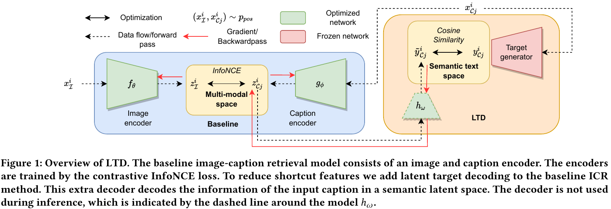

# Keep the Caption Information: Preventing Shortcut Learning in Contrastive Image-Caption Retrieval

This is the PyTorch code repository for the paper: [Keep the Caption Information: Preventing Shortcut Learning in Contrastive Image-Caption Retrieval](https://arxiv.org/abs/2204.13382), by [Maurits Bleeker](https://mauritsbleeker.github.io)<sup>1</sup>, [Andrew Yates](https://andrewyates.net)<sup>1</sup>, and [Maarten de Rijke](https://staff.fnwi.uva.nl/m.derijke/)<sup>1</sup>.
The entire project has been developed in Python and PyTorch.

<sup>1</sup><sub>University of Amsterdam</sub>

## Introduction

The code of this work is mainly based on the code repositories of [PCME](https://github.com/naver-ai/pcme), [VSRR](https://github.com/KunpengLi1994/VSRN), and [VSE++](https://github.com/fartashf/vsepp)  

Not all experiments we have run made it into the final version of the paper.




## Environment, dependencies and required packages

This project has been developed and tested in Python 3.6.13.
All the libraries and Python dependencies used in this work are provided in `src/requirements.txt`

```
pip install -r src/requirements.txt
python -c 'import nltk; nltk.download("punkt", download_dir="/downloads")'
```
 
## Data and data processing

For this work, we use the [Flickr30k (F30k)](https://shannon.cs.illinois.edu/DenotationGraph/), and [MS-COCO Captions dataset (COCO)](https://github.com/tylin/coco-caption), including the the [CrissCrossed Captions](https://github.com/google-research-datasets/Crisscrossed-Captions) annotations (CxC).

We store the entire dataset in a pickle file, this to make training faster than loading the images one-by-one from disk. However, this requires a large RAM memory.

Please note that most pre-processing files make use of fixed file path, you have to change this to the locations were you have stored the data/output files. 

### Data processing

The caption annotations and test/test/val splits for the MS-COCO and Flicker30k dataset can be downloaded [here](http://cs.stanford.edu/people/karpathy/deepimagesent/caption_datasets.zip).
In the folder `annotations/f30k` we provide the json file for the f30k dataset. The json file for MS-COCO is too big to upload to GitHub. 

To generate the pickle file, run the function `process_dataset(json_file, img_folder, dset_name, root, k=5)`  from the file `data/data_processing.py`.    

### Vocabulary classes 

Each dataset has a different vocabulary. In the file `data/vocab.py` the Vocabulary class is provided, together with the `build_vocab(captions, threshold=0)` function. 
In the file `notebooks/data_processing/vocab.ipynb`, we build the vocab for each dataset.
We provide a pickle file of the MS-COCO and F30k Vocab class used in this work in the folder `vocab/`, so you don't have to generate the vocabs files yourself.

### Adding the CxC annotations

To add the CxC annotations run `notebooks/data_processing/CrissCrossed.ipynb`.

### Targets generator

When the pickle file for the MS-COCO and Flicker30K dataset are generated the latent targets should be added.
To add the latent targets to the pickle files, run the `notebooks/data_processing/caption_targets.ipynb` file.

## Training and reproducing experiments 

To run the training script, simply run `python train.py --yaml_file configs/f30k/f30k_paper.yaml` for the F30k dataset and
`python train.py --yaml_file configs/coco/coco_paper.yaml` for the COCO dataset.

In the folder `configs/{coco, f30k}/{coco, f30k}_paper.yaml` the config yaml files are provided to train the baseline model. 

### Training hyper parameters used in this work

To train other and different model configurations, we change the following training hyper parameters.
 
- `--experiment.experiment_name`: name of the experiment. Used for the WandB logging and to store the model checkpoints.
- `--model.target_decoder.decode_target`: Decode a target for the caption representation.
- `--recconstruction_constraint.use_constraint`:  Use constraint based optimization.
- `--model.target_decoder.input_decoding`: Decode the caption in the input space.
- `--recconstruction_constraint.bound`: Lower bound value for the optimization constraint. 
- `--optimizer.weight_averaging.use_weight_averaging`: Use [Stochastic Weight Averaging](https://pytorch.org/blog/stochastic-weight-averaging-in-pytorch/). 
- `--model.image_encoder.cnn_type`: The of type of ResNet used for the image encoder backbone. Default is `resnet50`.
- `--train.n_epochs`: Number of training epcohs. Default value is `60`.
- `--model.caption_encoder.tune_from_start`: Tune the word embeddings for the caption encoder from the start of the training.
- `--lr_scheduler.name`: LR schedule used for training. Default is `cosine_annealing`, other option is `multi_step_lr`.
- `--lr_scheduler.milestones`: Number of epochs before lowering the lr with factor `finetune_lr_decay`. Only when using `multi_step_lr`.

All the other hyper parameters can be found in `configs/{coco, f30k}/{coco, f30k}_paper.yaml`. However, we do not change any of the other parameters for any experiment in the paper.

### Job files

All experiments for the paper has been run on a SLURM based compute cluster.
The job and hyper-parameter files are provided in the folder `jobs/paper_experiments/{coco, f30k}/`.

## Evaluation

To run a trained model on the test set run `python evaluate.py --path_to_model <path to model>/model_best.pth`, the run the model with the highest score on the validation set.
To use the validation set add the `--split val` flag. 

### Model checkpoints

All model checkpoints that generate the evaluation scores in the paper are available on request.

## Paper 

The pre-print of the paper for this work can be found [here](https://arxiv.org/abs/2204.13382). 

In the folder `/paper/plots`, the data and jupyter notebook is provided to generate the plots in Section 5.3 of the paper.

### Target directly experiments

To run the use targets directly/fixed-targets experiments (Section 5.6 in the paper), please witch to the `fixed-targets` branch. 
The config files are provided in the folder `src/configs/{f30k, coco}/{f30k, coco}_direct_target_paper.yaml`.
The hyper-parameters to run the experiments are given in the file `src/jobs/f30k/target_directly/f30k_target_directly_experiment_hyperparams.txt`.

## Citation

If you use this code to produce results for your scientific publication, or if you share a copy or fork,


```

```

